## SCIE

|                             封面                             |                        期刊                        | 分区 |        AIF        |          主编          | 学科 | 综述期刊 | 注释 |
| :----------------------------------------------------------: | :------------------------------------------------: | :--: | :---------------: | :--------------------: | ---- | ------------------------------------------------------------ | :----------------------------------------------------------: |
| 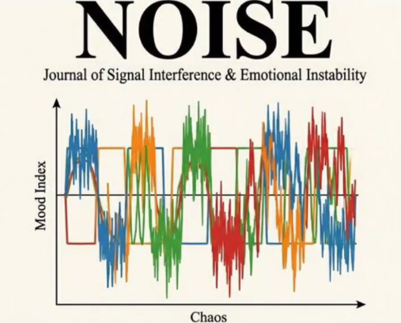 |                       Noise                        |  T4  |       11.45       |         @Noise         | 综合 |  |  |
| 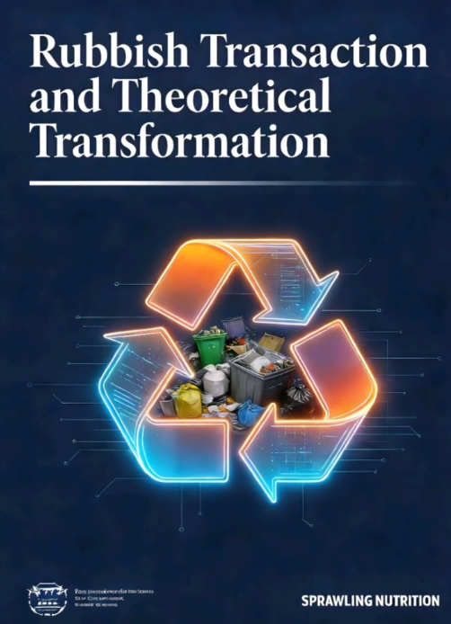 | Rubbish Transaction and Theoretical Transformation |  T4  | 66.6 | @RTTT Editorial Office | 综合，国产期刊 |  |  |
| 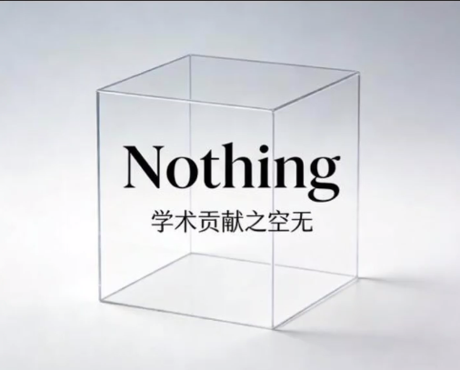 |                      Nothing                       |  T4  | 0 |         @四大地刊《Nothing》官号         | 综合 |  |  |
| 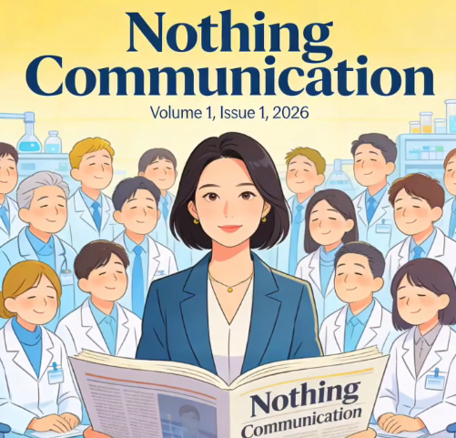 | Nothing communications | T4 | 10 | @Nothing Communications | 综合 |  |  |
| 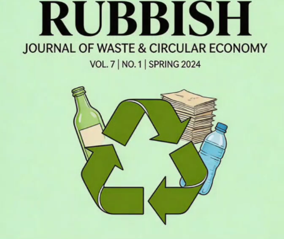 |                      Rubbish                       |  T4  |       100       |        @Rubbish        | 综合 |  | 当之无愧Top1 |
| 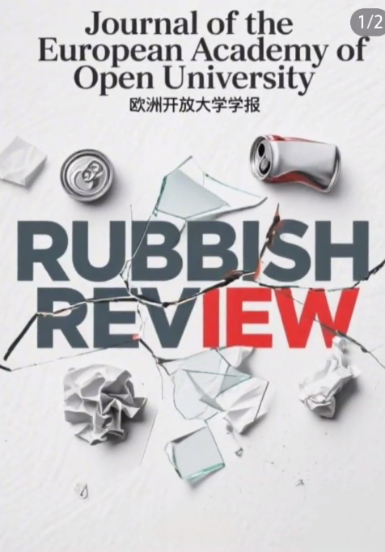 | Rubbish Review | T4 | 87 | @中国建筑文化出版社 | 综合 | 是 |  |
| 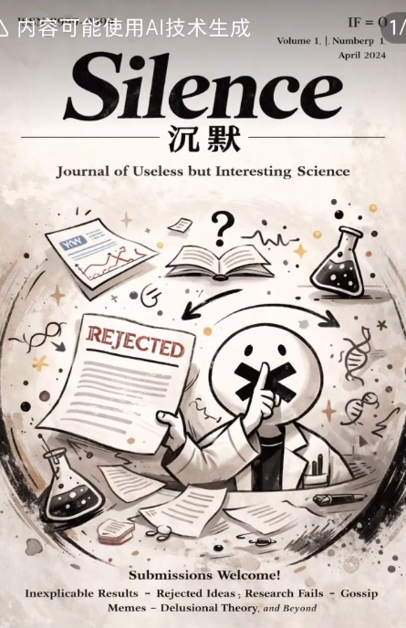 |                      Silence                       |  T4  | 45.8 |        @Silence        | 综合 |  | 同Science |
| 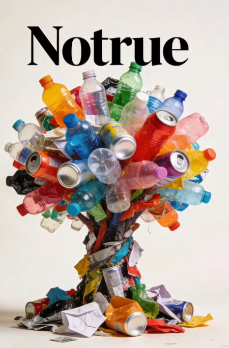 |                       Notrue                       |  T4  |           |        @Notrue         | 综合 |  |  |
| 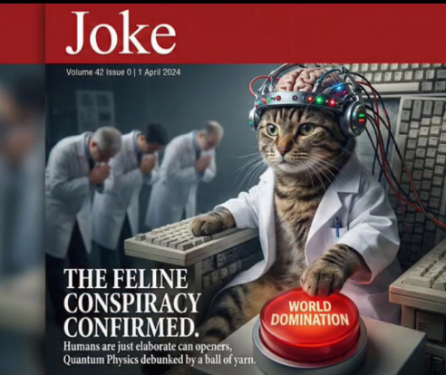 |                        Joke                        |  T2  |         🤡         |         @Joke          | 综合 |  |  |
| 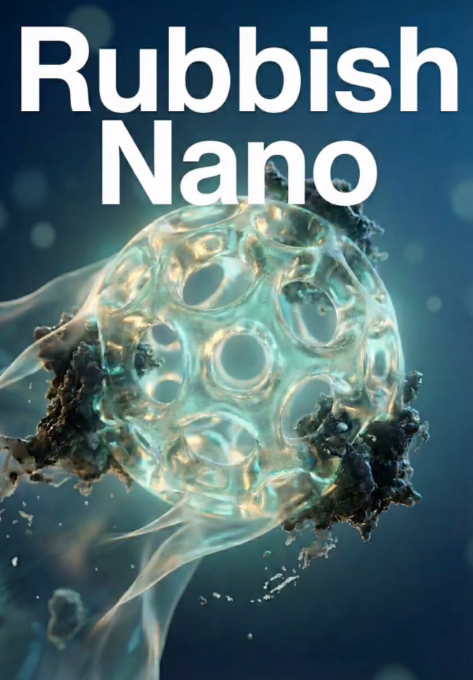 | Rubbish Nano | T2 | 16.1 | @Rubbish Nano | 化学/综合，纳米科技 |  | 同ACS nano |
| 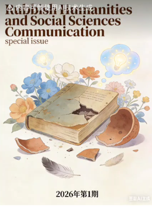 | Rubbish Humanities and Social Sciences Communications | T4 | 19.8 | @Rubbish HSSC | 神经科学，医学/心理学 | |  |
| 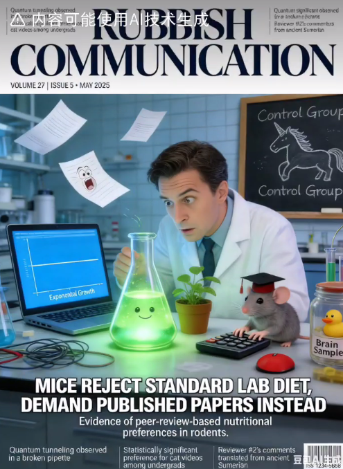 | Rubbish communication | T3 | 15.6 | @Rubbish communication | 综合 |  | 六耳猕猴（少个s） |
| 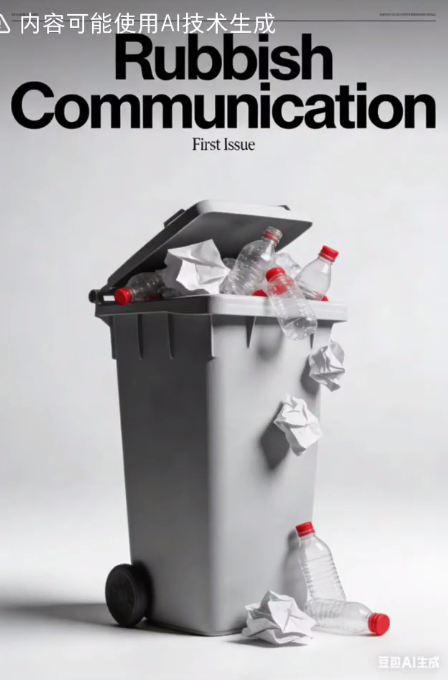 | Rubbish communications | T3 | 21.1 | @Rubbish communications | 综合 |  |  |
| 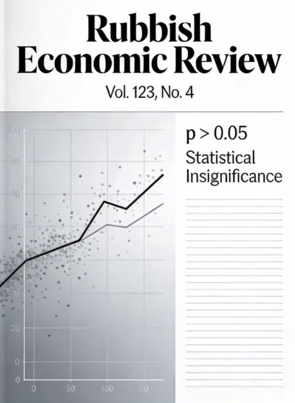 | Rubbish Economic Review | T4 | 44.32 | @Rubbish Economic Review | 经济学 | 是 |  |
| 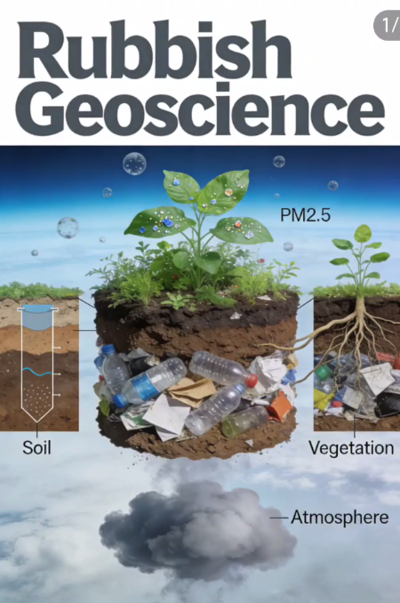 | Rubbish Geoscience | T4 | 21.6 | @Rubbish Geoscience | 地球科学 |  |  |
| 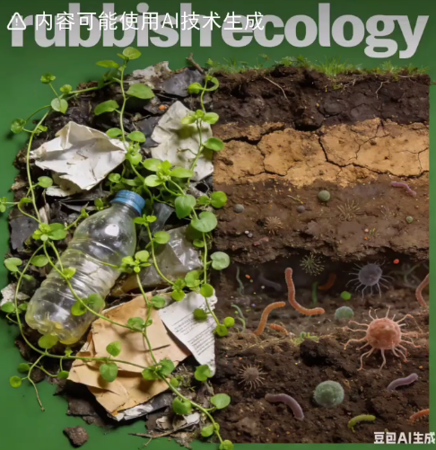 | Rubbish Ecology | T4 | 32.23 | @Rubbish Ecology | 环境科学 |  | 感觉是Rubbish很多的环境 |
| 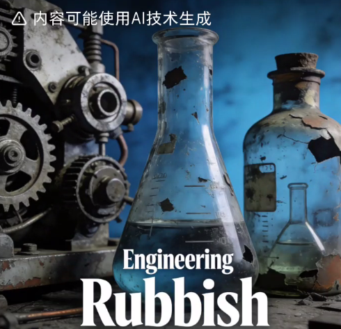 | Rubbish Engineering | T4 | 8.8 | @Rubbish Engineering | 工程学/综合 |  |  |
| 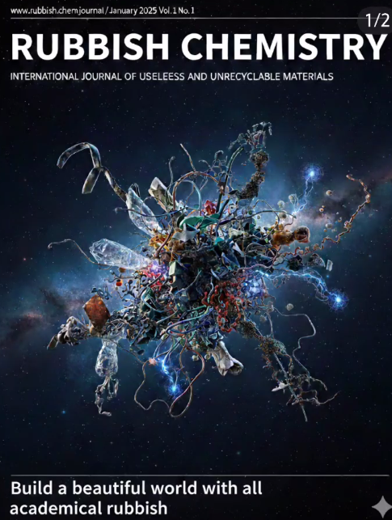 | Rubbish Chemistry | T4 | 33.5 | @Rubbish Chemistry | 化学/综合 |  |  |
| 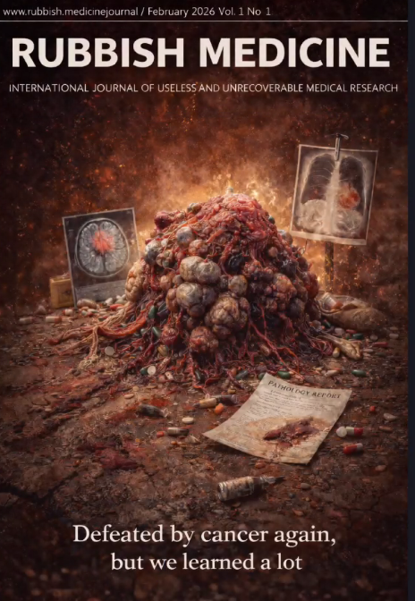 | Rubbish Medicine | T4 | 69.8 | @我叫哈利，没有波特 | 医学/综合 |  |  |
| 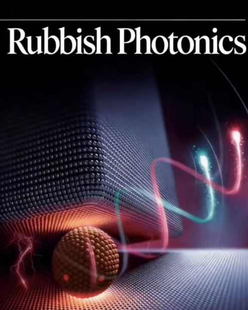 | Rubbish Photonics | T4 | 15.7 | @Rubbish Photonics editor |  |  |  |
| 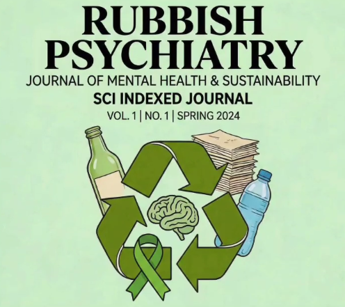 | Rubbish Psychiatry | T4 | 26.9 | @第二支羽毛 | 医学/心理学，医学/精神病学 | | |
| 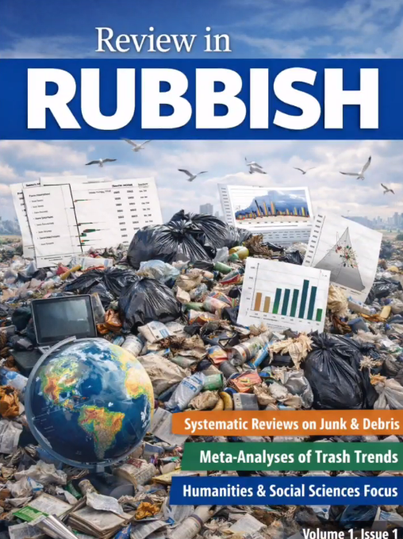 | Review in Rubbish | T3 | 2.7 | @Review in Rubbish | 综合 | 是 | |
| 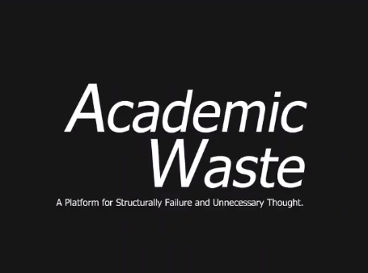 | Academic Waste | T2 | 5.5 | @Academic Waste | 综合 |  |  |
| 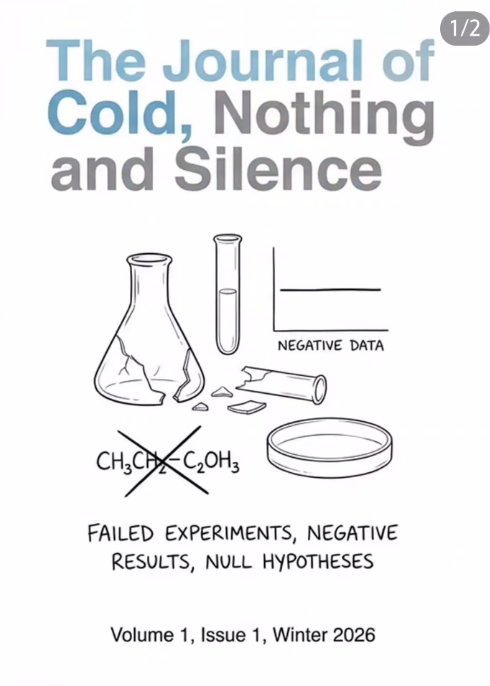 | The Journal of Cold, Nothing and Silence | T1 | 0.75 | @Nothing and Silence编辑部 | 综合 |          |期刊名不够抽象，不像底刊|
| 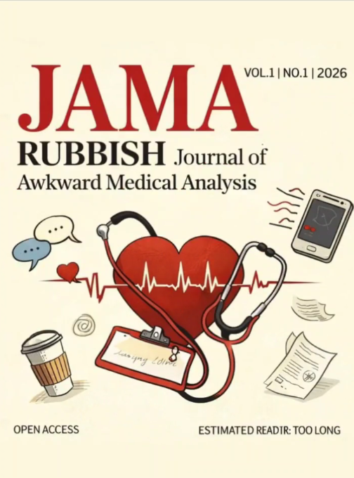 | JAMA Rubbish | T4       | 9.7  | @JAMA Rubbish |医学/临床医学||同JAMA network open|
| 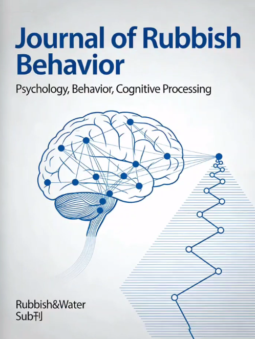 | Journal of Rubbish Behavior | T4 | 28.5 | @箱型核密度图（生活版） |神经科学，生物/心理学|||
| 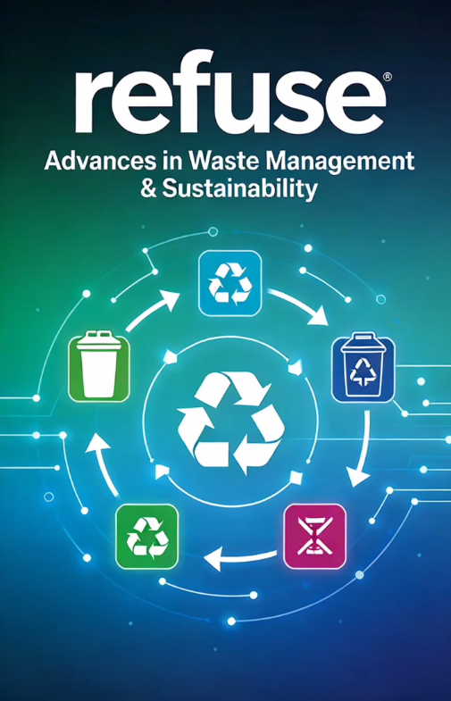 | Refuse | T1 | 0.1 | @学会侠 |综合||全refuse了，没有AIF|
| 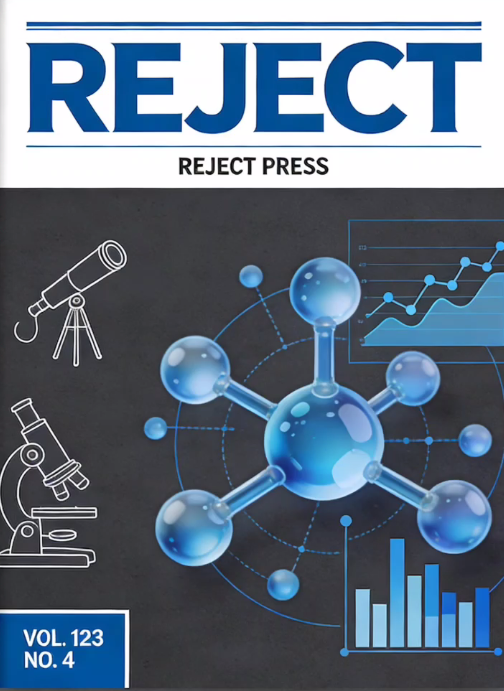 | Reject | T1 | 0.1 | @学会侠 |综合||以上期刊专门收录被传统学术体系筛选出的“不合格品”并且拒绝被传统学术期刊筛选出来的“标准品”。刊名在作为名词时，是指被判定为不合格、无利用价值的“不合格品”或“废弃物”;而作为动词有着拒绝的含义。但我们的本质并非盲目否定付出的学术努力，也并非对“不合格品”的拒绝，而是反向定义了合格标准，倒逼筛选体系的优化，显示本刊对作品来源的定位和取舍，挖掘来稿作品的价值边界和“无用之物”大智慧。通过主动发掘正规期刊看不上的“废弃物”，规避内耗、聚焦核心，以彰显本刊清醒的价值判断和正向的发展导向作用|
| 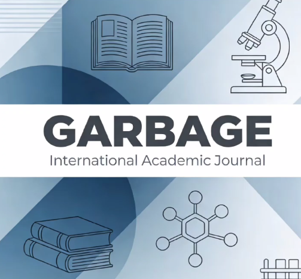 | Garbage | T1 | 0.1 | @学会侠 |综合||Cells对Cell的拙劣模仿|
| 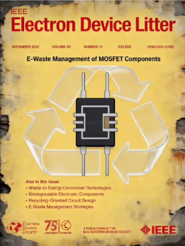 | IEEE Device Litter | T3 | 5.5 | @啊啵啵不肥 |信息技术||没有Transactions，看来不是bottom期刊|
| 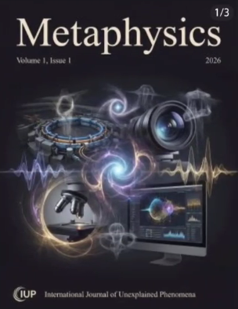 | Metaphysics | T2 | 2.9 | @BigSmart |物理学/玄学||玄学领域小底刊|
| 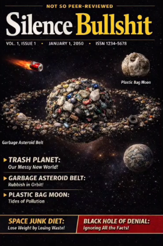 | Silence Bullshit | T4 | 16.9 | @OK不K |综合，国产期刊||跟RTTT并称国产双雄|
| 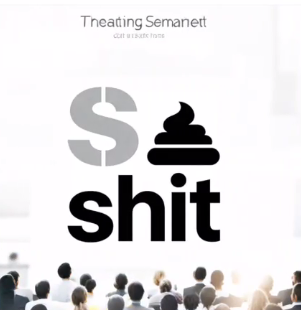 | Sh/*t | T2 | 7.5 | @shit |医学/消化系统疾病|||
| 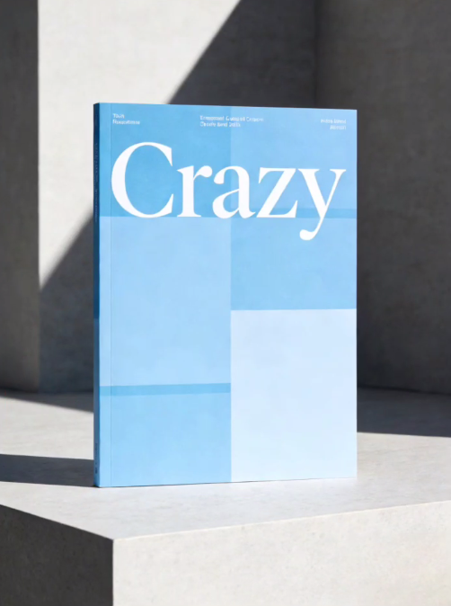 | Crazy | T4 | 7.8 | @《Crazy》期刊 |医学/心理学||心理学小底刊|
| 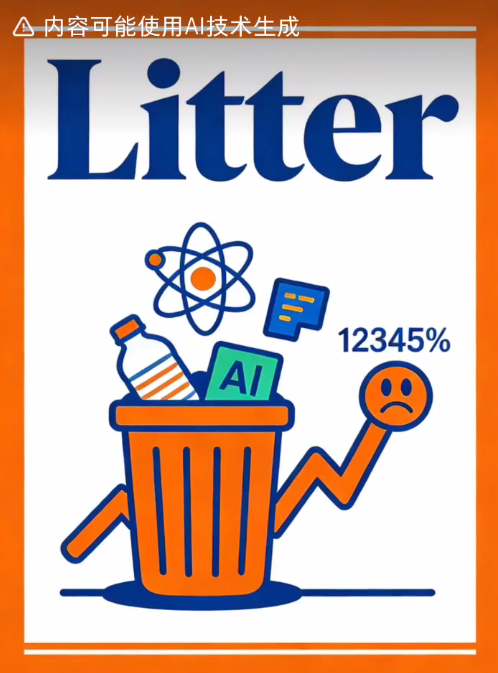 | Litter | T4 | -1 | @Litter期刊编辑部 | 综合 |          |分不高，但是挺难投|
| 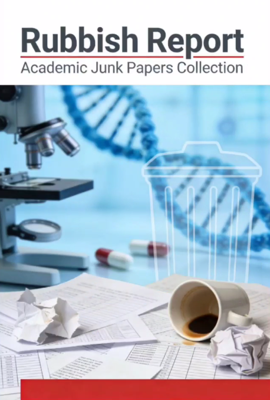 | Rubbish report | T1 | 4.2 | @Rubbish Report编辑部 | 综合 | |大水刊|
| 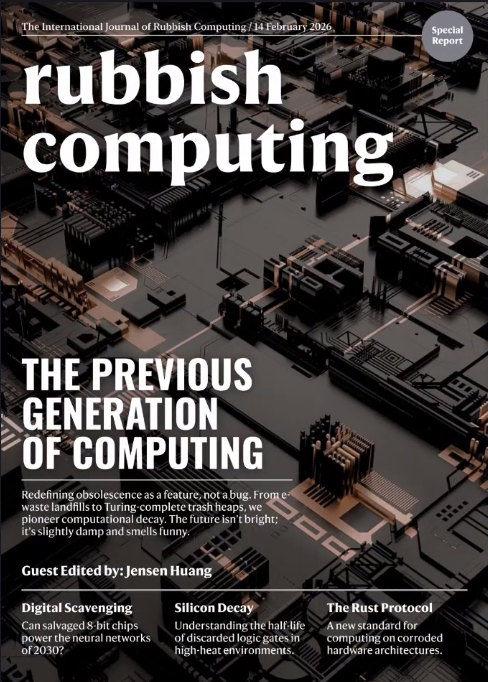 | Rubbish computing | T4 | 22.56 | @Rubbish Computing | 信息科学 | |曾被联合抵制，但是真香|
| 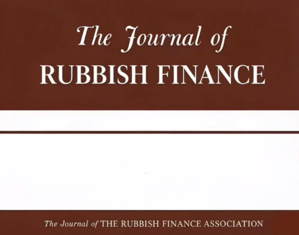 | Journal of Rubbish Finance | T3 |  | @JournalofRubbishFinance | 经济学 | ||
| 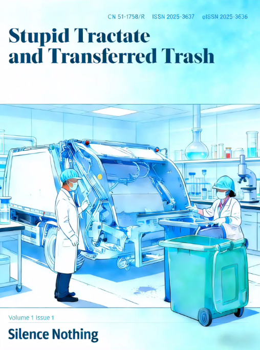 | Stupid Tractate and Transferred Trash |  |  | @STTT | 综合，国产期刊 | |直接碰瓷！|
| 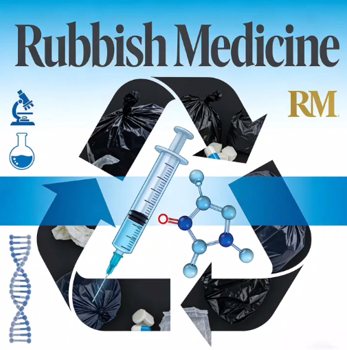 | Rubbish Medicine |  |  | @Rubbish Medicine Report | 医学/综合 | ||
| 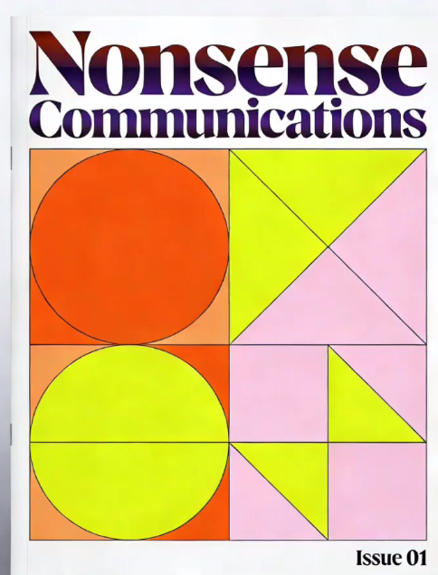 | Nonsense Communications |  |  | @Nonsense Communications | 综合 | |人称小nonsense|
| 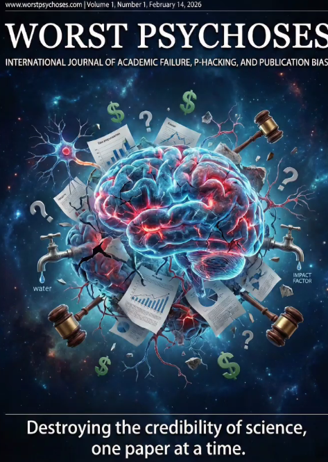 | Worst Psychoses |  |  | @Worst Psychoses | 医学/神经病学，医学/认知科学 | |那非常worst了|
| 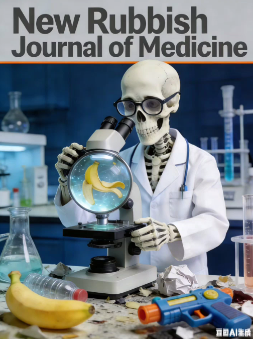 | New Rubbish Journal of Medicine |  |  | @NRJM官方账号 | 医学/综合 | |新英格兰人称小NRJM|
| 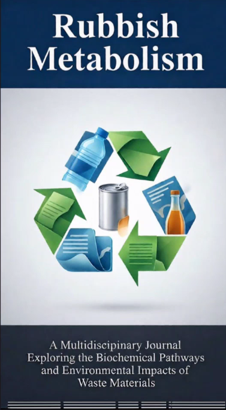 | Rubbish Metabolism |  |  | @Rubbish Metabolism |  | ||
| 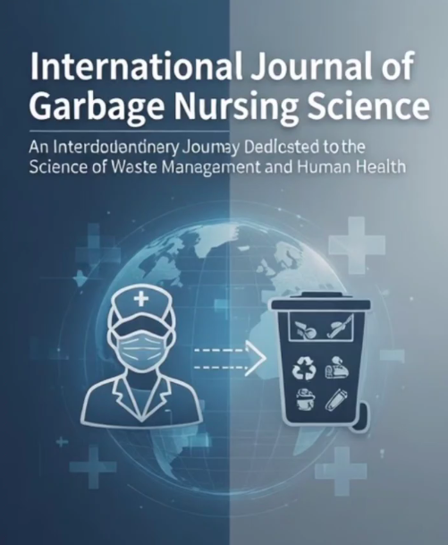 | International Journal of Garbage Nursing Science |  |  | @Int. J. Garb. Nurs. | 医学/护理学 | |护理学的第一本抽象期刊！|
|  | Rubbish Story |  |  | @Rubbish Story（故事会） | 文学/科幻 | ||
| 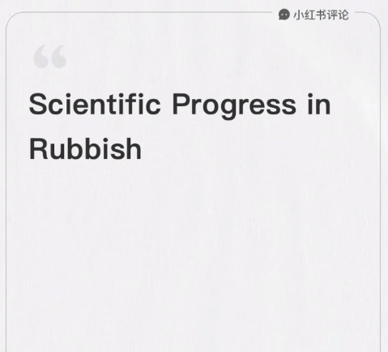 | Scientific Progress in Rubbish |  |  | @Evan[发呆] | 综合 | ||
| 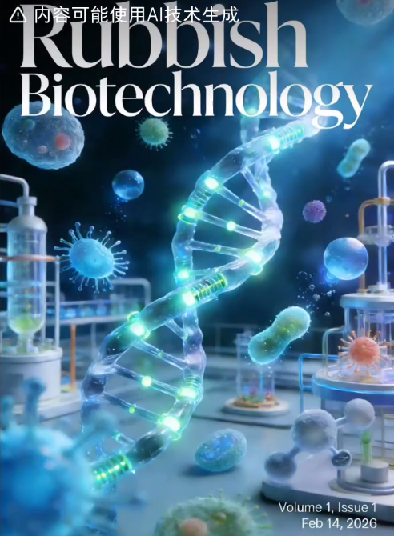 | Rubbish Biotechnology |  |  | @Rubbish Biotechnology | 工程学/生物医学工程，医学/综合 | ||
| 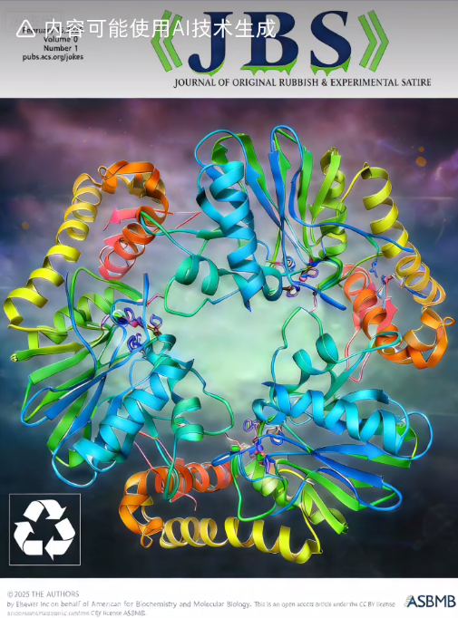 | Journal of Bio-Rubbish and Statistic |  |  | @JBS编辑部 | 数学/统计学，医学/综合 | ||
| 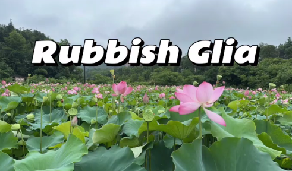 | Rubbish Glia |  |  | @Rubbish Glia | 医学/综合，生物学 | ||
| 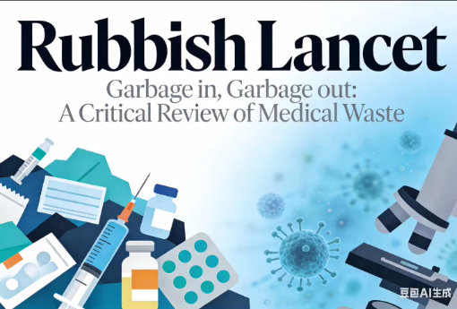 | Rubbish Lancett |  |  | @Rubbish Lancett | 医学/综合 | ||
| 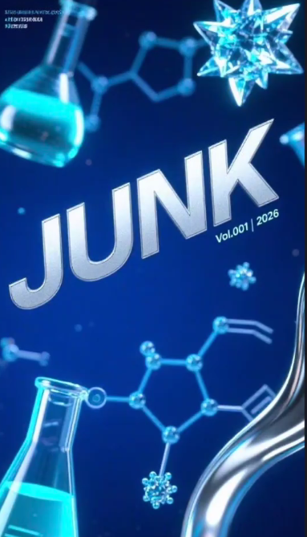 | Junk |  |  | @JUNK SCI | 综合 | ||
| 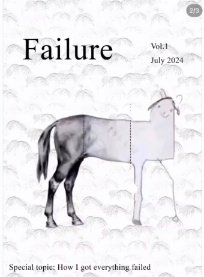 | Failure |  |  | @小泽Mark | 综合 | ||
| 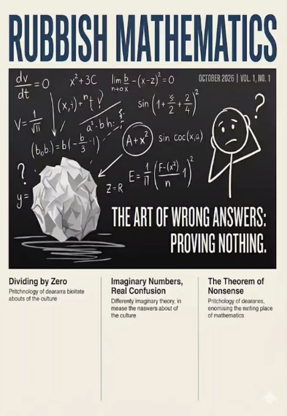 | Rubbish Mathematics |  |  | @Rubbish Mathematics | 数学/综合 | ||
| 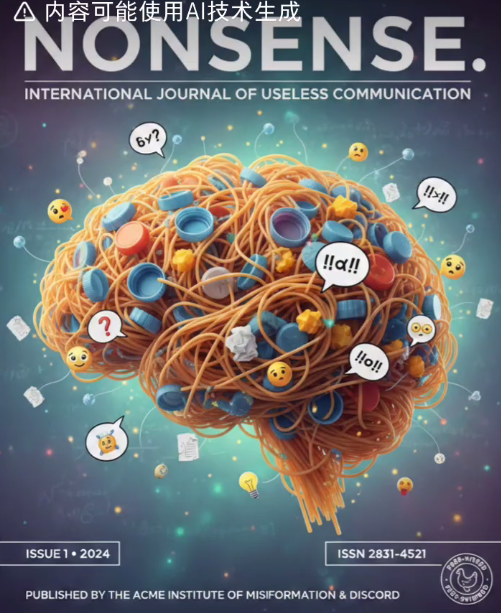 | Nonsense |  |  | @Nonsense | 综合 | ||
| 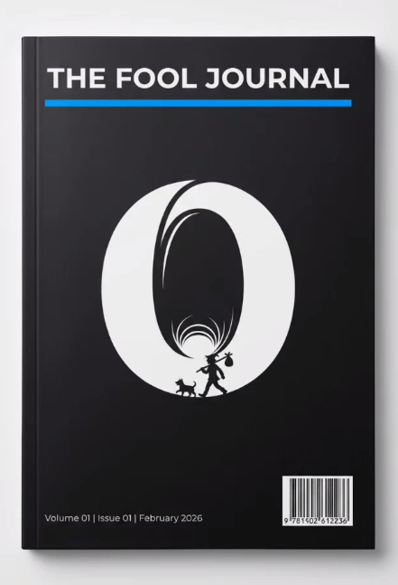 | The Fool |  |  | @The Fool | 人类学 | ||
| 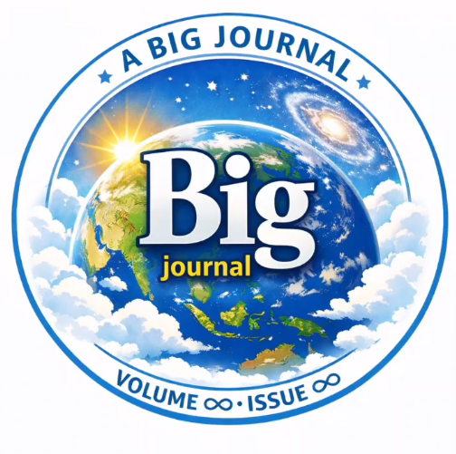 | BIG |  |  | @BIG编辑部 | 纳米科技 | |听说small已经降为二区了！|
| 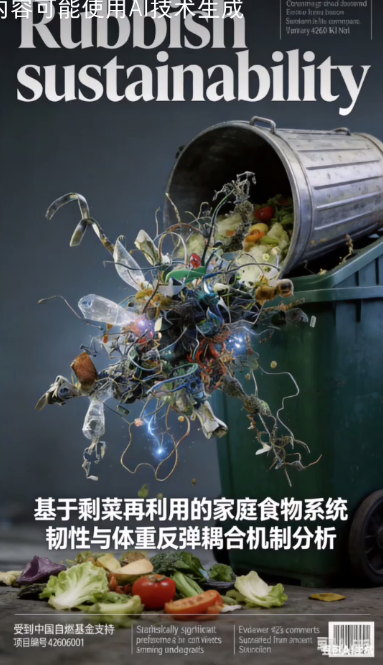 | Rubbish Sustainability |  |  | @Rubbish Sustainability | 环境科学 | |希望rubbish系列能持续下去|
| 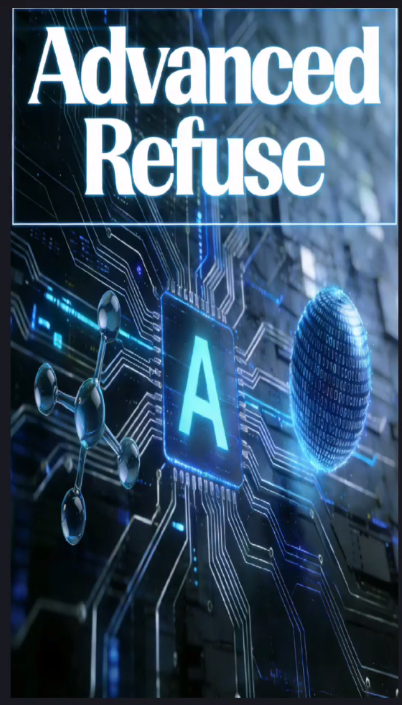 | Advanced Refuse |  |  | @Advanced Refuse | 综合 | ||
| 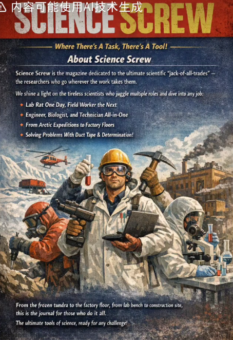 | Science Screw |  |  | @在逃葱油饼 | 综合 | |AAAS连夜切割|
| 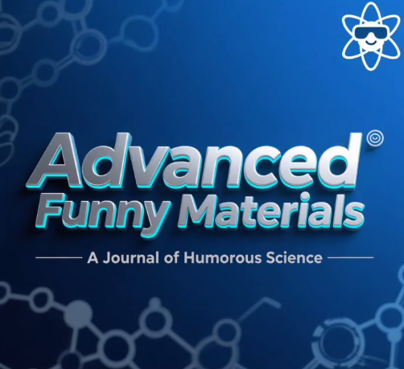 | Advanced Funny Materials |  |  | @Advanced Funny Materials | 工程学/材料科学 | |AFM是李逵还是李鬼？|
| 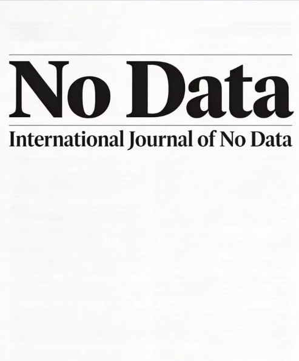 | International Journal of No Data |  |  | @No Data | 数据科学 | |没事，WOA还有点索引数据|
| 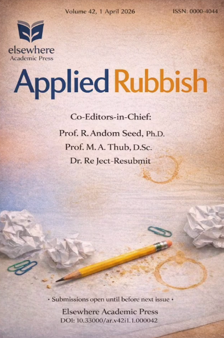 | Applied Rubbish |  |  | @Applied Rubbish | 综合 | ||
| 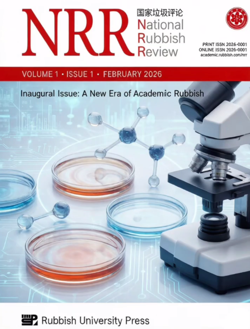 | National Rubbish Review |  |  | @National Rubbish Review | 综合，国产期刊 | |国产又一力作|
| 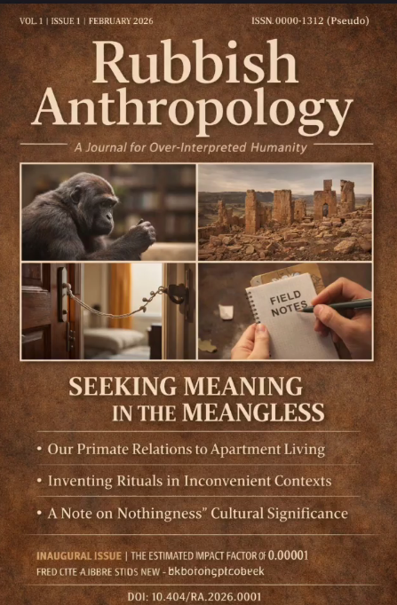 | Rubbish Anthropology |  |  | @Rubbish Anthropology | 人类学 | |垃圾从哪里来？|
| 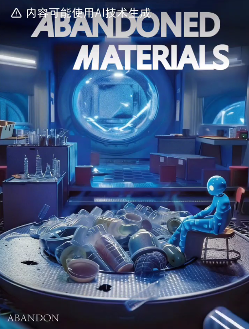 | Abandoned Materials |  |  | @Abandoned Materials | 工程学/材料科学 | |很难突破第一页单词|
| 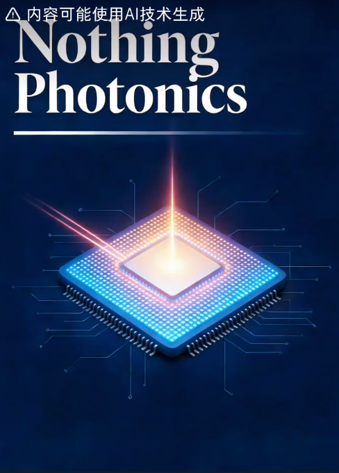 | Nothing Photonics |  |  | @Austin BuBu | 物理学/光学 | ||
| 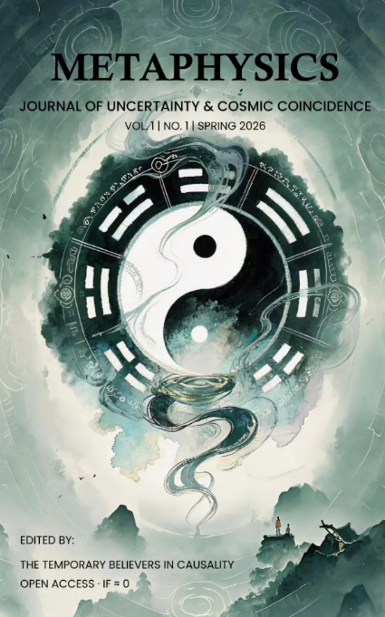 | METAPHYSICS |  |  | @METAPHYSICS | 物理学/玄学 | |玄学赛道异常拥挤|
| 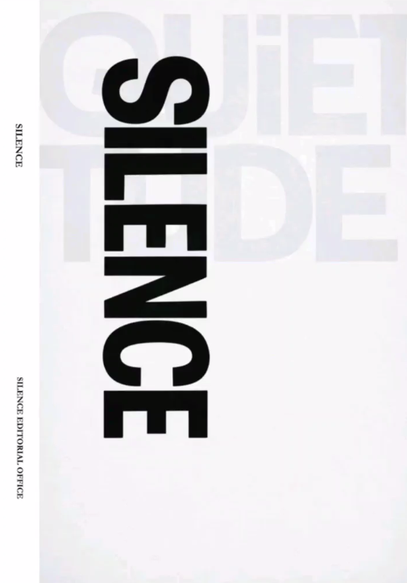 | Silence |  |  | @Silence | 综合 | ||
| 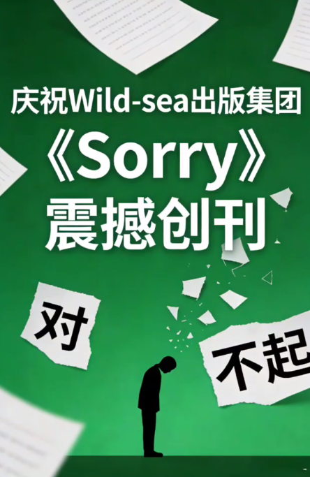 | Sorry |  |  | @《Crazy》期刊 | 医学/心理学 | ||
| 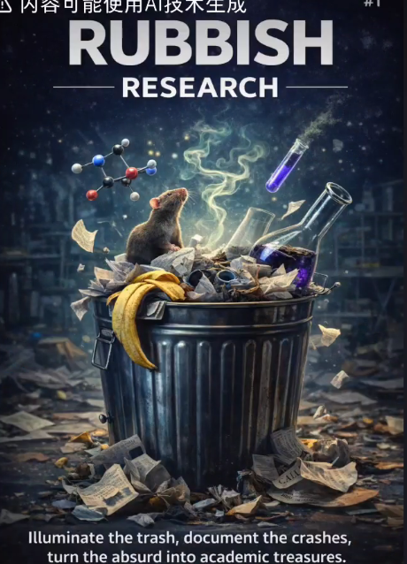 | Rubbish Research |  |  | @Rubbish Research | 综合 | ||
| 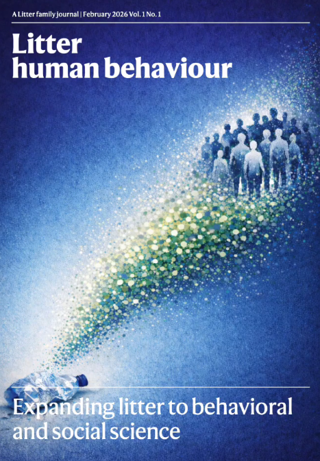 | Litter Human Behavior |  |  | @Litter Human Behavior | 神经科学，医学/心理学 | ||
| 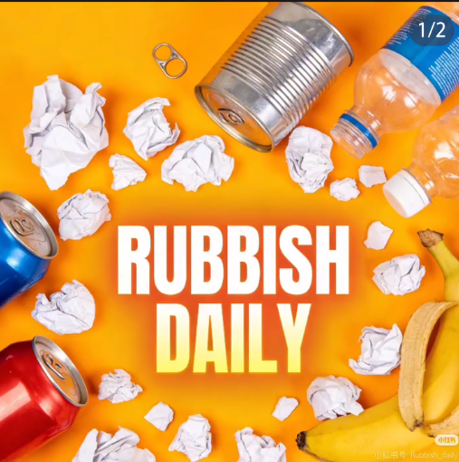 | Rubbish Daily |  |  | @Rubbish Daily | 文学 | |兄弟们，他真发过nc|
| 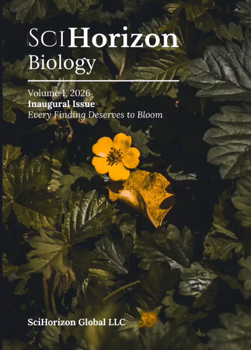 | SciHorizon: Biology |  |  | @0xLLLLLL | 生物学 | |简称SB|
|  | Call |  |  | @Call期刊编辑部 | 综合 | |中国小Cell|
|  | WeCheat Communications | | | @Wecheat Communications | 信息技术 | |已经发表的论文只能保存7天|
|  | Frontiers in Bullshitology | | | @《前沿废话》期刊 | 语言学 | ||
|  | Joker of Academics | | | @Joker Of Academics | 综合 | ||

## 核心期刊

| 封面                                                         | 期刊               | 分区     | AIF  | 主编                | 学科          | 综述期刊 | 注释               |
| ------------------------------------------------------------ | ------------------ | -------- | ---- | ------------------- | ------------- | -------- | ------------------ |
| 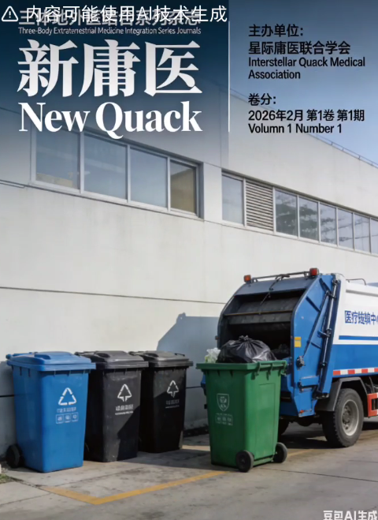 | 新庸医             | 核心期刊 | 1.2  | @新庸医             | 医学/临床医学 |          |                    |
| 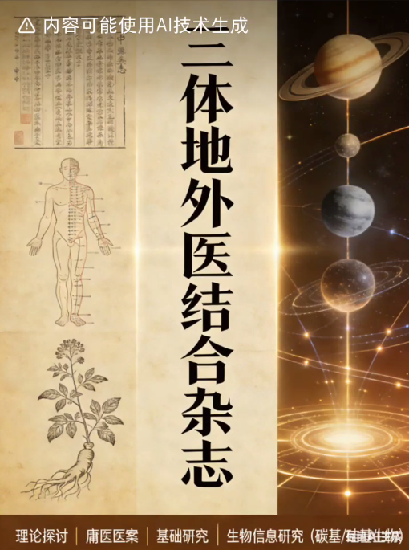 | 三体地外医结合杂志 | 核心期刊 | 1.6  | @三体地外医结合杂志 | 医学/中医     |          | 中医学顶刊         |
| 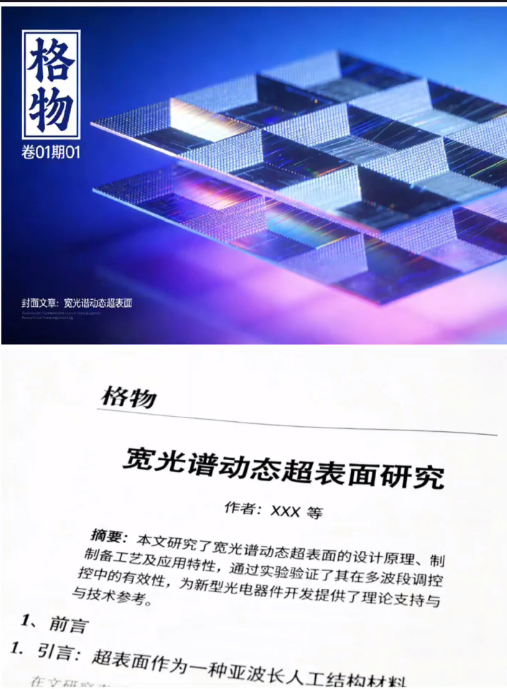 | 格物               | 核心期刊 |      | @FormatLong         | 物理学        |          | 王阳明当创刊主编？ |
|  | 中国织网           | 核心期刊 |      | @中国织网           | 综合          |          | 那美国织什么？     |

## 会议

| 封面                                                         | 期刊                                        | AIF  | 主编              | 学科 | 综述期刊 | 注释 |
| ------------------------------------------------------------ | ------------------------------------------- | ---- | ----------------- | ---- | -------- | ---- |
| 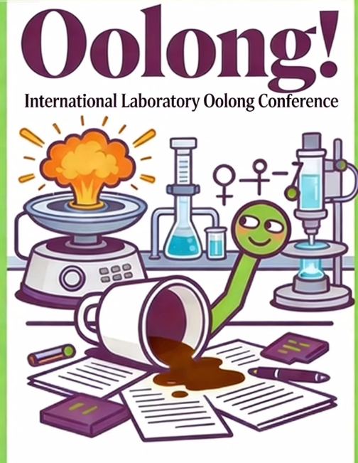 | Internaltional Laboratory Oolong Converence |      | Litter 期刊编辑部 | 综合 |          | ILOC |
|                                                              |                                             |      |                   |      |          |      |
|                                                              |                                             |      |                   |      |          |      |

